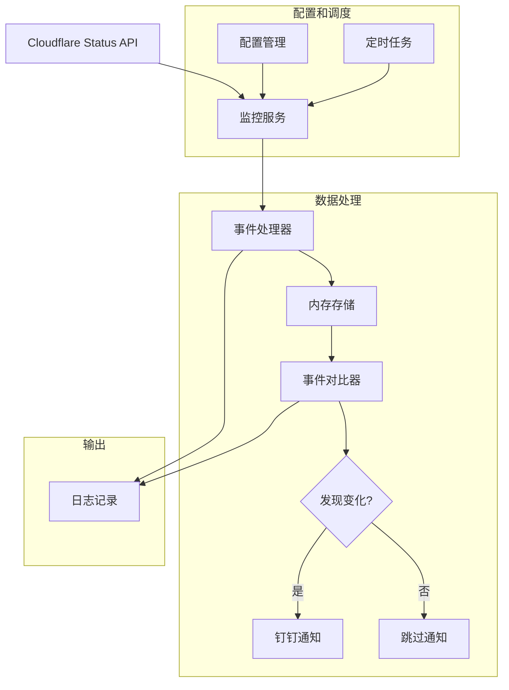
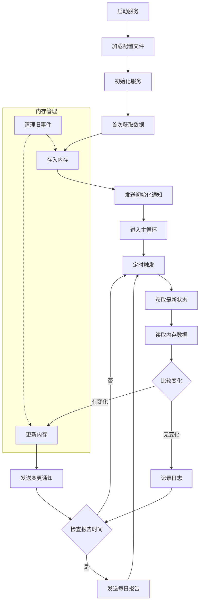

# Cloudflare 状态监控服务

这是一个用于监控 Cloudflare 服务状态的工具，它可以实时获取 Cloudflare 的事件信息，并通过钉钉机器人发送通知。

## 架构设计

## 系统组件

1. **数据源**
   - Cloudflare Status API：提供实时状态数据

2. **核心组件**
   - 监控服务：定期获取状态数据
   - 事件处理器：分析和处理事件
   - 内存存储：保存最近的N个事件（可配置数量）
   - 事件对比器：比较新旧事件变化

3. **输出组件**
   - 钉钉通知：发送告警和报告
   - 日志记录：记录运行状态

## 工作流程

## 主要功能

1. **实时监控**
   - 定期获取 Cloudflare 状态信息
   - 支持配置检查间隔时间
   - 只保留最近的N个事件（可配置）

2. **事件处理**
   - 检测新事件
   - 检测事件更新
   - 按时间排序
   - 清理过期事件

3. **通知功能**
   - 钉钉机器人通知
   - 支持 Markdown 格式
   - 包含详细的事件信息
   - 每日状态报告

4. **配置管理**
   - 支持配置文件
   - 命令行参数支持
   - 灵活的配置项

## 配置说明

配置文件（env.config）示例：
\`\`\`ini
# 检查间隔（分钟）
CHECK_INTERVAL_MINUTES=10

# 每日报告时间（UTC，0-23）
DAILY_REPORT_UTC_HOUR=0

# 最大事件数量
MAX_INCIDENTS=5

# 钉钉配置
DINGTALK_WEBHOOK_TOKEN=your_dingtalk_webhook_token_here
DINGTALK_SECRET=your_dingtalk_secret_here
\`\`\`

## 安装和使用

1. **编译程序**
\`\`\`bash
go build -o cf-status
\`\`\`

2. **运行服务**
\`\`\`bash
./cf-status -c /path/to/env.config
\`\`\`

3. **使用 systemd 服务**
\`\`\`bash
sudo cp cf-status.service /etc/systemd/system/
sudo systemctl daemon-reload
sudo systemctl start cf-status
sudo systemctl enable cf-status
\`\`\`

## 通知格式

1. **新事件通知**
\`\`\`markdown
# Cloudflare 状态更新

时间: 2024-XX-XX XX:XX:XX

## 新事件
### 事件: [事件名称]
- ID: [事件ID]
- 状态: [状态]
- 影响程度: [影响]
- 创建时间: [时间]
...

---
详细状态请访问: https://www.cloudflarestatus.com/
\`\`\`

2. **每日报告**
\`\`\`markdown
# Cloudflare 每日状态报告

报告时间: 2024-XX-XX XX:XX:XX

[事件详情列表]

---
详细状态请访问: https://www.cloudflarestatus.com/
\`\`\`

## 注意事项

1. **配置相关**
   - 所有配置项都必须设置有效值
   - 检查间隔不要设置太短，建议 5 分钟以上
   - UTC 时间需要考虑时区差异

2. **系统要求**
   - 需要持续运行的环境
   - 需要网络访问权限
   - 建议使用 systemd 管理服务

3. **日志管理**
   - 程序会输出详细日志
   - 建议配置日志轮转
   - 定期检查日志内容

4. **安全考虑**
   - 配置文件权限建议设置为 600
   - 钉钉 Token 和 Secret 需要妥善保管
   - 建议使用非 root 用户运行

## 故障排查

1. **服务无法启动**
   - 检查配置文件权限
   - 验证配置文件格式
   - 查看系统日志

2. **无法获取数据**
   - 检查网络连接
   - 验证 API 地址可访问
   - 查看详细错误日志

3. **通知未送达**
   - 验证钉钉配置
   - 检查网络连接
   - 查看钉钉机器人响应

## 开发说明

1. **代码结构**
   - 模块化设计
   - 使用互斥锁保护共享数据
   - 完整的错误处理

2. **扩展建议**
   - 可添加更多通知方式
   - 可扩展监控指标
   - 可添加数据持久化

3. **测试建议**
   - 添加单元测试
   - 进行压力测试
   - 模拟各种异常情况 